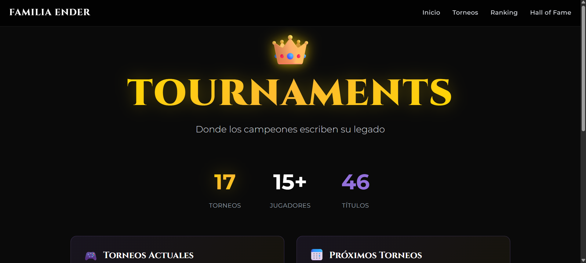

# 👑 Familia Ender Tournaments

> Donde los campeones escriben su legado ⚔️  

**Familia Ender Tournaments** es una página web interactiva que registra, organiza y muestra los torneos competitivos de la comunidad **Familia Ender**, con un diseño moderno, visual y dinámico.  

El proyecto sirve como **hub central de torneos**, mostrando resultados, rankings globales y un “Hall of Fame” con los campeones de cada evento.

---

## 🚀 Demo en línea

🌐 **Sitio desplegado en Netlify:**  
➡️ [https://familia-ender-tournaments.netlify.app](https://familia-ender-tournaments.netlify.app) *(reemplazá con tu URL real)*

---

## 🧱 Características Principales

- 🗓️ **Calendario de Torneos:** muestra todos los eventos realizados en el año.
- 🧩 **Tabla Global de Campeones:** ranking dinámico por cantidad de títulos.
- 👑 **Hall of Fame:** destaca a los ganadores de cada torneo con estilo dorado y animaciones.
- 🧍‍♂️ **Perfiles de jugadores (en construcción):** sección reservada para futuras estadísticas personales.
- 🎨 **Diseño responsive y moderno:** basado en **TailwindCSS** y tipografías de Google Fonts.
- ⚡ **Interactividad total en un solo archivo HTML:** sin dependencias externas ni backend.

---

## 🖼️ Vista Previa

_(Podés agregar una imagen o captura del sitio)_

```markdown

